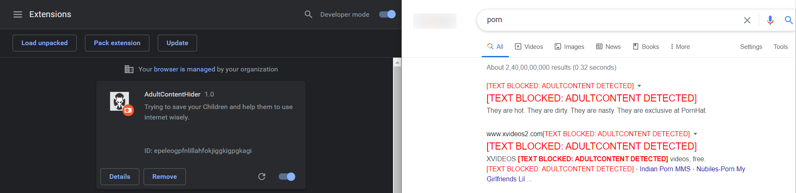

# AdultContentHider - Chrome Extension 

This extension will save you from reading any Bad and Adult content words as well as visual images.  

I am not an expert with Google Chrome Development and this is my first extension made ever. 

# Features
- **Worss Blocking**: Searches entire web page and replaces Bad or Adult content words with text `##[TEXT BLOCKED: ADULTCONTENT DETECTED]`
- **Image Blurring**: Blurs the neighbouring Images which are relevant and might related to those words.
- **Simple, BugLess and Easy**: If there's a bug, it's a feature.
- **Open Source**: On serious note, if there's an issue, please log it and also raise a PR if you can fix it.
- **Customizable**: As you have the source code, you can customize it as per your needs ;) 

# How To Use?
- Clone this repository or download as a zip file
- Incase you downloaded as a zip, unzip it
- Open Google Chrome
- Go to `chrome://extensions`
- Click on `Load Unpacked` which you can see in the top left side.
- Select the path where you cloned/downloaded this project.
- An icon  should appear besides your Chrome Search bar.
- That's all If u search for any cuss words or badwords or pornographic words it will blur those contents

# Do u have any ideas?
- Create a branch and contribute...
- Do like and fork my repository😁😁

# Credits and Motivation
- Rachit and the repository link is <a href="https://github.com/rachitiitr/GameOfThrones-ChromeExtension">here</a>